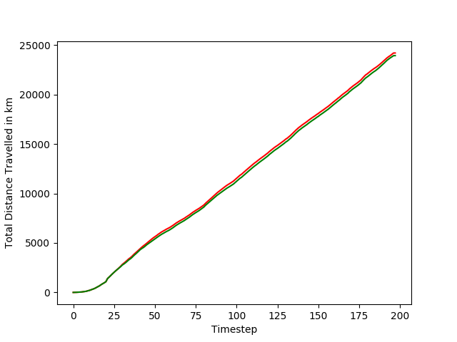
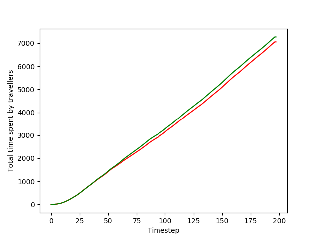

## Introduction

Over the last 4 years ride sharing has changed the way people commute by introducing a travel mode that is something between that of a traditional cab a public bus. To explain ride sharing in simple terms, multiple users declare to the system their current location and their destination. The system then tries to combine the rides of multiple users together such that at the cost of slightly extra travel time on the part of rider, the overall cost of the system is reduced which can be reflected as a cheaper ride for the passenger as long as she doesn’t mind sharing a cab.

Right now, the system is such that once a rider is assigned a car and begin her ride it is guranteed that the same car would complete the ride for her until the destination.

However, even if for purely theoritcical reasons we assume that that doesn’t have to be so. What if it doesn't have to be guaranteed that the same car has to start and finish a ride but in fact the ride can be broken down amongst multiple different cars, there is then a new potential to save on the **sum distance** traveled by all the cars. We optimize such that cabs currently engaged in a trip have the ability to transfer their rides and save on net distance traveled without compromising on net time traveled per rider.

An immediate practical application would be for a food delivery system such as **Uber Eats**. To translate the cab scenario to the the Uber Eats scenario, we can have each food parcel treated as a trip, and each delivery person as a cab. We can then remove the constraint that the same delivery person delivers the food, who picks it up from the resteraunt, and that the parcel can change hands multiple times before reaching its destination. This can optimize between the net time spent traveling by all the delivery persons without compromising on the time taken to deliver individual parcels.

### Game of Taxis and Riders.
Riders are interested in getting to their locations as fast as possible, while cab companies would be interested in clubbing as many riders possible in the same car. The time spent by riders is inversly proportional to the number of taxies available to them. A form of optimization is in pitting the interested parties against each other like in a game and asking each to make the best decision avaible to themselves, this allows both parties in principle, that is the riders and cabs as a whole, to come away with something acceptable and aggreable while not letting anyone lose too much.

We model the taxi allocation service as a min-max game. Where we simulate the interests of each party consequitively until we reach the optimal point which is the best that both can offer to each other.

First, to explain how we build this tree we have to explain what is meant by a game state. A game state is a description of the world as we know it at a given point in time. In our game we have cabs, rides and locations. Cabs and riders are designated by unique identifiers, and at any time one or more riders can be assigned to a cab. Locations are lat-long coordinates on a map. Rides are routes or strings of locations, the first point of which is the start point and the last the end point, and every location is the location of the ride T seconds later. The game state consists of the list of cabs, list of rides, the assignment of rides to cabs and the current mapping of rides to coordinate points. Any change in any of these will create a new game state.

At every time step t each of the cabs C will attempt to minimize its own journey by attempting to transfer its ride to the closest cab to it (minimization part). For every combination of cabs, in the next game, there may have been a transfer or not. Which means that if there are C cabs then there could be C/2 possible transfers, the possible games states are now 2^(C/2), the powerset of combinations. For every game state, every subsequent gamestate is generated until depth D. After that, at every level of the game tree the game state that promises the minimum sum travel time (maximization part, since minimizing travel time means maximizing sum distance) is chosen and the metrics (distance traveled and sum travel time) is propogated to its parent, until its route and at the root the projected routes for each car and trip are updated so as to achieve the optima.

The deeper the tree is the better the effect of long term benefits can be captured in current decisions. However the computation would be longer.

## Dataset and implementation
### Dataset:
The dataset that used here is the one used for the ECML/PKDD 15: Taxi Trajectory Prediction available here https://www.kaggle.com/c/pkdd-15-predict-taxi-service-trajectory-i/data.
The taxi trip data had positions for timesteps 15 seconds apart however the offsets from zero are multiple of one.
We preprocessed the data so that taxi position are interpolated between the timesteps such that the timesteps are 30 seconds apart and the start point offsets from zero are multiples of 30.

### Assumptions
To simplify the model we make some assumptions as below:
* The timesteps are currently 30ms apart, inorder to improve computation time. Otherwise it can be 1s or lesser according to the data and % accuracy gains.
* Only those cars that are mutually the closest cars to each other are taken into consideration when choosing transfers. It is true that without this assumption we may actually find more optimal results, however to limit the game tree we make this assumption at the loss of some optimality.
* We assume the average speed of the cars to be 20km/hr. This is used to project the amount of time a car would take to traverse a new path given to it.
* When assigning paths the cars take the crow flies distance between two locations, without accounting for actual path taken or the traffic situation on those roads. This can be adjsuted in the above average speed.
* To further prune the game space, we only allow clubbing of rides where the amount of extra time that a ride would have would be lesser than a given % of the initial ride.

### Transfer Mechanism
The (currently rudimentary) transfer mechanism of rides is as follows.
* Taking the paths of the two chosen cars, one car is chosen to be the transferee and the other the transferor, based on the fact that the amount of extra time to be ridden by the existing rider of the transferor is lesser.
* When the transfer begins the transferee stops in its tracks while the transferor makes its way to the transferee to transfer its ride. After they meet the transferor’s contribution to the ride is stopped and it is not tracked anymore. The transferee then makes its way to the its original destination and then to the destination of the transferor’s original ride.

### Putting the whole thing together
* At every time step each car chooses cars with which it suggests clubs. Each of these are added to list of *possible_clubbings*, game states are created for each member of the powerset of *possible_clubbings* called *possible_clubbings_power*.
* At each game state the transfer of the rides happen according to the clubbings that to happen as listed by the the corresponding member of *possible_clubbings_power*.
* If not maximum depth then recursively the gamestates for the next timestep are created until maximum depth where the projected time and total distance traveled along with the projected new paths (policy) are sent back up the game tree.
* At the root the movement of the cars are based on the new paths projected.

### Possible improvements
* Currently the number of rides that can be clubbed into a car is not limited.
* Once a ride is clubbed into another ride we currently lose information of the existence of separate rides as the new route covers both the destinations without knowledge of which is which. Maintaining this information of separate rides would allow us the split the already clubbed ride further. What this translates to is if A and B are clubbed then somewhere down the line A alone can be clubbed to the ride of another car while B continues on the current car. This has scope for further optimization.
* When transfering the passenger currently one car stops in its tracks and waits for other car to reach it. We can improve this so that we can project an optimal future position at which the two cars can meet.
* When two rides are clubbed the car still makes it first to the destination of its original ride and then to the second destination even if the second destination was on the path to its first.
* Improving our model of the world so that we cut back on the number of assumptions that have to made

### Running the code
* Download the training data from  https://www.kaggle.com/c/pkdd-15-predict-taxi-service-trajectory-i/data.
* Run preprocess.py. Some of the parameters at the top in the code can be varied.
* Run minmax.py for the simulation.
* Run measure.py to create the graphs and measure the total distance and total time traveled since the beginning.

### Results

We ran the simulation for about 95 minutes of simulated time, with the assumptions as described above. Here we can see that over time the number of kms we save are about 300 kms across about 205 cars for the cost of about 220 mins of extra traveled time across 350 trips.

It took 2 hours to run on an i7-8700 processer, but pruning and smarter implentation, not to mention a GPU implementation can drive down the time taken to process while allowing for deeper game tree.

The red line in this graph corresponds to the number of km traveled in total by all the cars without sharing. The green line represents the total number of kms traveled by all the cars while sharing.

The red line in the graph corresponds to the total time spent by the riders while sharing in not implemented. The green line is the total amount of time spent by all the riders while sharing is implemented.

  | Time elapsed        | Total Km traveled without sharing           | Total Km traveled while sharing  | Total time traveled by all riders when not sharing  | Total time traveled by all rides while sharing  |
  | ------------- |:-------------:| -----:|------:|------:|
  | 1      | 2.19119045022 | 2.19119045022 |1 |1 |
  | 12      | 2037.40265207      |   2037.40265207 |489 |489 |
  | 25 | 5630.62400822      |  5411.06059512 |1426 |1447 |
  | 37 | 8294.51379317     |  8071.05658011 |2278 |2384 |
  | 50 | 11535.1135995    |  11234.3034996 |3147 |3281 |
  | 62 | 14860.4393929      |    14562.5287273|4097 |4274 |
  | 75 | 18092.5498906      |    17801.0257577 |5097 |5302 |
  | 87 | 21336.9459637     |   21048.1295963 | 6172 |6390 |
